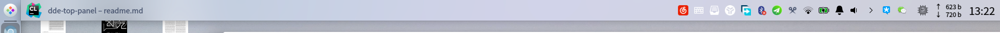
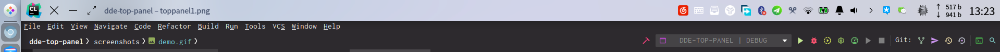
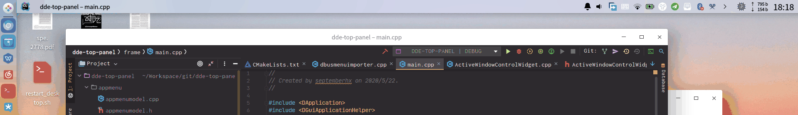
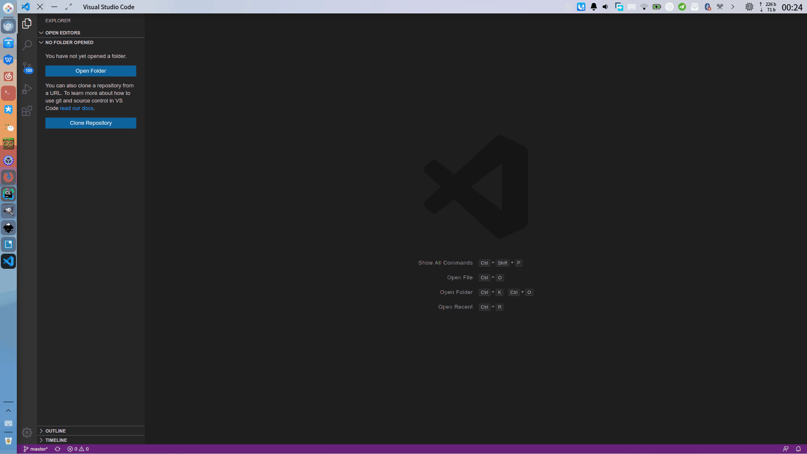
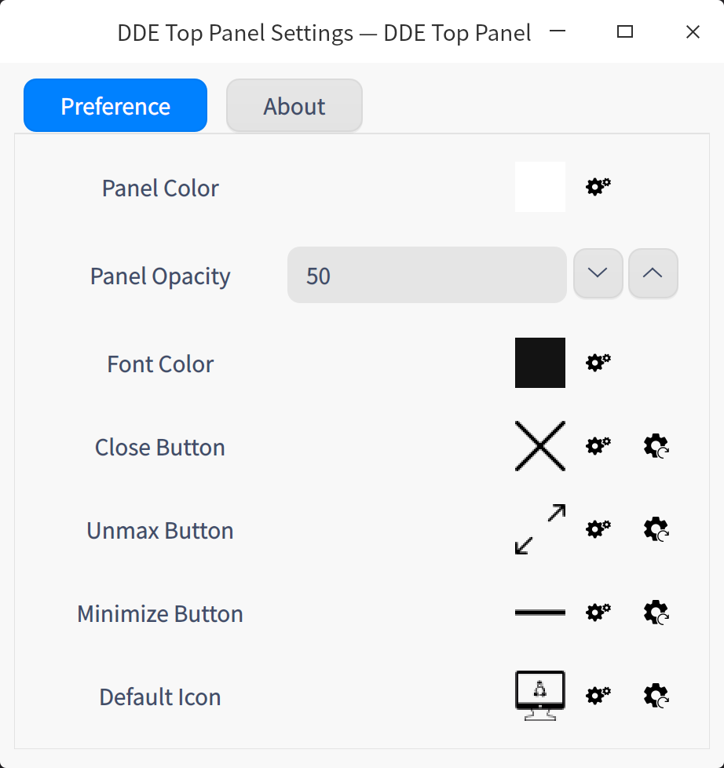

# DDE Top Panel

[](https://www.buymeacoffee.com/septemberhx)

【中文请看】：[Deepin 论坛](https://bbs.deepin.org/forum.php?mod=viewthread&tid=195128&extra=)
【全局菜单基本原理请看】：[Github WIKI](https://github.com/SeptemberHX/dde-top-panel/wiki/Linux-%E4%B8%8A%E7%9A%84%E5%85%A8%E5%B1%80%E8%8F%9C%E5%8D%95%E5%8E%9F%E7%90%86)

Top panel for deepin desktop environment v20.

This is a modification of dde-dock for top panel. Comparing to dde-dock, it:
* remove the launcher, show desktop, multi tasking, and application icons
* full support for dde-dock plugins and tray
* remove lots of unnecessary things so it is just a top panel. It is fixed to the top of the screen, and there is no way to change that.
* separate plugin config gsetting path `/com/deepin/dde/toppanel`
* different plugin directories: `/usr/lib/dde-top-panel/plugins` and `~/.local/lib/dde-top-panel/plugins`

| Plugin | Description |
| ------ | ------      |
| [dde-istate-menus](https://github.com/SeptemberHX/dde-istate-menus) | Plugin for showing CPU/RAM/MEM/Time |
| [dde-smart-dir](https://github.com/SeptemberHX/dde-smart-dir) | Plugin for listing files ordered by last modification time in watched folders |
| [dde-mpris2](https://github.com/SeptemberHX/dde-mpris2-plugin) | Plugin for controlling music player and show lyric |

## Features

* global menu support (with dde-globalmenu-service)
* show window title on top panel
* show title buttons on top panel when current window maximized
* double-clicking on empty area on top panel will maximize current window
* dragging and moving current maximized window by dragging empty area of top panel
* remove the window title bar when maximized
* support multi monitors
* personal customization

Know issues:
* panels on **non-primary monitors** only have the window title function. The plugins can not work on them. `It is not an issue` because the `QPluginLoader` can only create one instance from one plugin file. So the panel cannot create as many plugin widgets as the panels. Still trying to add the plugin back to all panels
* Shortcuts of the global menu not work

## Screenshot










## How to run

### For Deepin V20

1. download deb package from releases and install the deb package. you can enable the auto-start in the launcher
2. for removing the title bar of maximized windows, you can enable this feature in the settings by right clicking
3. If you want to use plugins on top panel, just copy the plugin files to `~/.local/lib/dde-top-panel/plugins`. For example, if you want to get tray icons on top panel, just `cp /usr/lib/dde-dock/plugins/libtray.so ~/.local/lib/dde-top-panel/plugins`
4. If you want to enable the global menu, please install [dde-globalmenu-service](https://github.com/SeptemberHX/dde-globalmenu-service.git)

### For Other distributions

I only have deepin v20 installed on my computer, and I cannot compile it for other distributions. So it needs to be built from source.

Dependency: `Qt5Widgets, Qt5Concurrent, Qt5X11Extras, Qt5DBus, Qt5Svg, DtkWidget, DtkCMake, KF5WindowSystem, XCB_EWMH, DFrameworkDBus, QGSettings, DtkGUI`

```shell
sudo apt install git cmake g++ qtbase5-dev libqt5x11extras5-dev libqt5svg5-dev libdtkwidget-dev libdframeworkdbus-dev libgsettings-qt-dev qttools5-dev libkf5windowsystem-dev libxcb-ewmh-dev libxdo-dev
git clone https://github.com/SeptemberHX/dde-top-panel.git
cd dde-top-panel
mkdir build
cd build
cmake ..
make -j8 package
```
Then a deb package will be generated.

## For tray icons of wine applications

Due to the logical of tray plugins, only one tray widget can hold the wine trays (You can click the icon and it will response to the click).

The main code of wine trays is in `plugins/tray/xembedtraywidget`. Generally, it wraps the raw wine trays with a new widget and embeds it to the tray, then it operates on the new widget. The problem is every tray widget will create a new container widget for each wine trays, and the tray widgets launched before can't the window id of the new container widget.

Just move `libtray.so` from `/usr/lib/dde-dock/plugins/libtray.so` to `~/.local/lib/dde-top-panel/plugins/`. Then there will be no tray icons on dock.

------

<div>Icons made by <a href="https://www.flaticon.com/authors/freepik" title="Freepik">Freepik</a> from <a href="https://www.flaticon.com/" title="Flaticon">www.flaticon.com</a></div>
