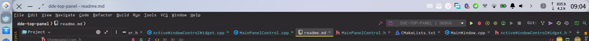

# DDE Top Panel

Top panel for deepin desktop environment v20.

This is a modification of dde-dock for top panel. Comparing to dde-dock, it:
* remove the launcher, show desktop, multi tasking, and application icons
* full support for dde-dock plugins and tray
* remove lots of unnecessary things so it is just a top panel. It is fixed to the top of the screen, and there is no way to change that.
* separate plugin config gsetting path `/com/deepin/dde/toppanel`
* different plugin directories: `/usr/lib/dde-top-panel/plugins` and `~/.local/lib/dde-top-panel/plugins`

> Still in development.

Know issues:
* it seems impossible to set the minimum height of the top panel less than 40, or there will be abnormal left and right spacing/margin around the plugin widgets. `setMargins` and `setSpacing` seem not work.
* The position of the top panel somethings will not be the top when there are some windows block it.
* The corner of the top panel is round. `setRadius` doesn't help

There are still many issues, but at least it works with tray and plugins.

## Screenshot

## How to run

1. cp `xml/*.xml` to `/usr/share/glib-2.0/schemas`, and run `sudo glib-compile-schemas /usr/share/glib-2.0/schemas`
2. download the file `bin/dde-top-panel` and run it.